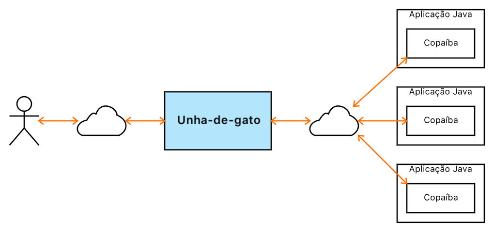

# Unha-de-gato

Concentrador de [Copaíbas](http://joseflavio.com/copaiba).

Concentrator of [Copaíbas](http://joseflavio.com/copaiba).

## Descrição

A Unha-de-gato é uma aplicação que faz a intermediação na comunicação com [Copaíbas](http://joseflavio.com/copaiba), mantendo [pools de conexões](https://pt.wikipedia.org/wiki/Pool_de_conex%C3%B5es).

A figura a seguir ilustra o esquema geral da arquitetura da Unha-de-gato:



## Versão Atual

1.0-A15

Padrão de versionamento: [JFV](http://joseflavio.com/jfv)

## Instalação do Servidor Unha-de-gato no Docker

Seguem-se as instruções para instalar e executar a Unha-de-gato num container Docker. Os argumentos de cada comando precisam ser revisados e especificados conforme o ambiente de execução.

Baixar e compilar:

```sh
wget https://github.com/joseflaviojr/unhadegato/archive/1.0-A15.zip
unzip 1.0-A15.zip
cd unhadegato-1.0-A15
gradle dist
```

Criar imagem:

```sh
docker build --force-rm -t joseflavio/unhadegato:1.0-A15 .
```

Criar volume de dados:

```sh
docker volume create --name unhadegato
```

Executar pela primeira vez:

```sh
docker run --name="unhadegato" -d -p 8885:8885 -p 8886:8886 -v unhadegato:/volume --ip=x.x.x.x --net xxxxxx --restart=unless-stopped joseflavio/unhadegato:1.0-A15
```

> A Unha-de-gato será inicializada automaticamente no processo de boot, a não ser que seja voluntariamente parada: `docker stop unhadegato`.

Configurar:

```sh
cd /var/lib/docker/volumes/unhadegato/_data/conf
```

> Algumas configurações exigem a reinicialização da aplicação: `docker restart unhadegato`.

Verificar arquivos de log:

```sh
tail /var/lib/docker/volumes/unhadegato/_data/logs/unhadegato.log -n 100
```

### Requisitos para Instalação

* Docker >= 17.06
* Git >= 2.8
* Java >= 1.8
* Gradle >= 3.1

### Desinstalação

Desinstalar a Unha-de-gato por completo:

```sh
docker rm -f unhadegato
docker rmi joseflavio/unhadegato:1.0-A15
```

## Execução Local e Temporária

Baixar e compilar:

```sh
wget https://github.com/joseflaviojr/unhadegato/archive/1.0-A15.zip
unzip 1.0-A15.zip
cd unhadegato-1.0-A15
gradle dist
```

Executar:

```sh
cd build/dist
./unhadegato.sh
```

> Os requisitos são os mesmos da instalação padrão, com exceção do Docker.

## Como Usar no Lado do Cliente

A Unha-de-gato está disponível como biblioteca Java no repositório [Maven](http://search.maven.org/#artifactdetails%7Ccom.joseflavio%7Cunhadegato%7C1.0-A15%7Cjar).

Gradle:

```
compile 'com.joseflavio:unhadegato:1.0-A15'
```

Maven:

```xml
<dependency>
    <groupId>com.joseflavio</groupId>
    <artifactId>unhadegato</artifactId>
    <version>1.0-A15</version>
</dependency>
```

### Requisitos para uso como cliente

* Java >= 1.8

## Documentação

A documentação da Unha-de-gato, no formato **Javadoc**, está disponível em:

[http://joseflavio.com/unhadegato/javadoc](http://joseflavio.com/unhadegato/javadoc)

## Desenvolvimento

Configuração do projeto para Eclipse e IntelliJ IDEA:

```sh
gradle eclipse
gradle cleanIdea idea
```

### Requisitos para desenvolvimento

* Git >= 2.8
* Java >= 1.8
* Gradle >= 3.1

## Compilação

Para compilar o projeto, gerando os arquivos JAR, executar no terminal:

```sh
gradle clean build
```

## Publicação

Para compilar e publicar os arquivos finais do projeto no repositório [Maven](http://search.maven.org/#artifactdetails%7Ccom.joseflavio%7Cunhadegato%7C1.0-A15%7Cjar), executar no terminal:

```sh
gradle clean uploadArchives
```

## Licença

### Português

Direitos Autorais Reservados &copy; 2016-2018 [José Flávio de Souza Dias Júnior](http://joseflavio.com)

Este arquivo é parte de Unha-de-gato - [http://joseflavio.com/unhadegato](http://joseflavio.com/unhadegato).

Unha-de-gato é software livre: você pode redistribuí-lo e/ou modificá-lo
sob os termos da [Licença Pública Menos Geral GNU](https://www.gnu.org/licenses/lgpl.html) conforme publicada pela
Free Software Foundation, tanto a versão 3 da Licença, como
(a seu critério) qualquer versão posterior.

Unha-de-gato é distribuído na expectativa de que seja útil,
porém, SEM NENHUMA GARANTIA; nem mesmo a garantia implícita de
COMERCIABILIDADE ou ADEQUAÇÃO A UMA FINALIDADE ESPECÍFICA. Consulte a
Licença Pública Menos Geral do GNU para mais detalhes.

Você deve ter recebido uma cópia da Licença Pública Menos Geral do GNU
junto com Unha-de-gato. Se não, veja [https://www.gnu.org/licenses/lgpl.html](https://www.gnu.org/licenses/lgpl.html).

### English

Copyright &copy; 2016-2018 [José Flávio de Souza Dias Júnior](http://joseflavio.com)

This file is part of Unha-de-gato - [http://joseflavio.com/unhadegato](http://joseflavio.com/unhadegato).

Unha-de-gato is free software: you can redistribute it and/or modify
it under the terms of the [GNU Lesser General Public License](https://www.gnu.org/licenses/lgpl.html) as published by
the Free Software Foundation, either version 3 of the License, or
(at your option) any later version.

Unha-de-gato is distributed in the hope that it will be useful,
but WITHOUT ANY WARRANTY; without even the implied warranty of
MERCHANTABILITY or FITNESS FOR A PARTICULAR PURPOSE. See the
GNU Lesser General Public License for more details.

You should have received a copy of the GNU Lesser General Public License
along with Unha-de-gato. If not, see [https://www.gnu.org/licenses/lgpl.html](https://www.gnu.org/licenses/lgpl.html).
